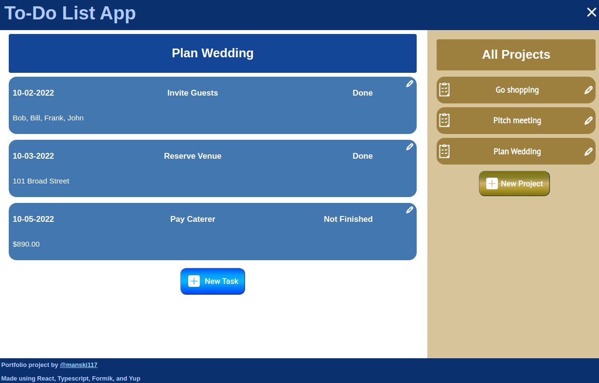
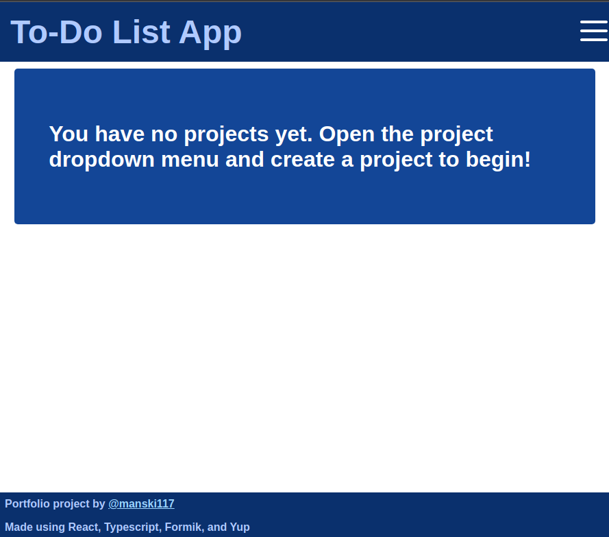
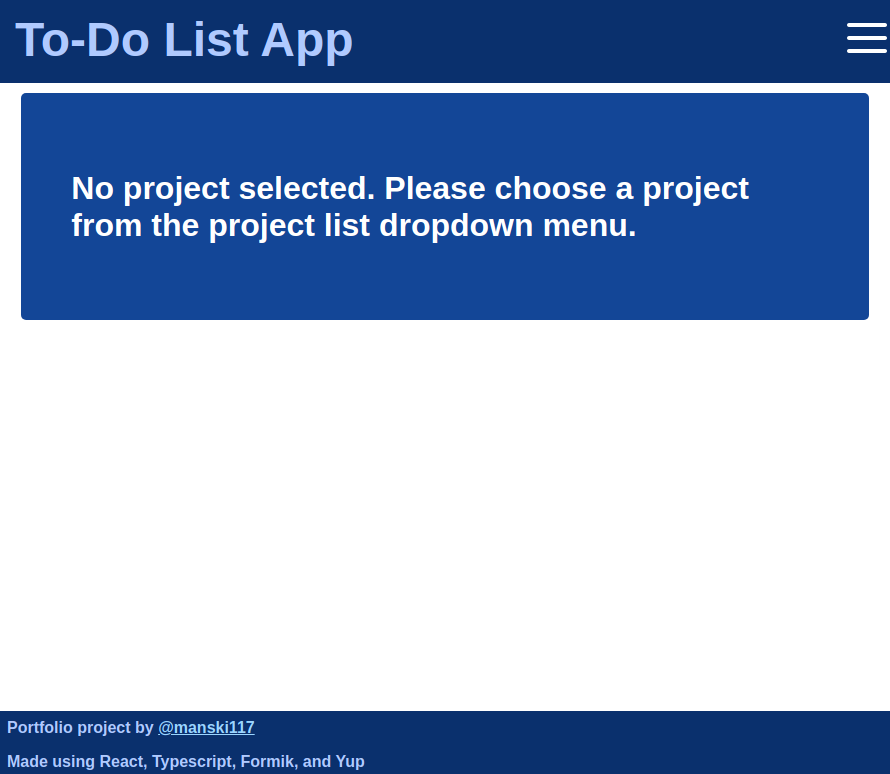
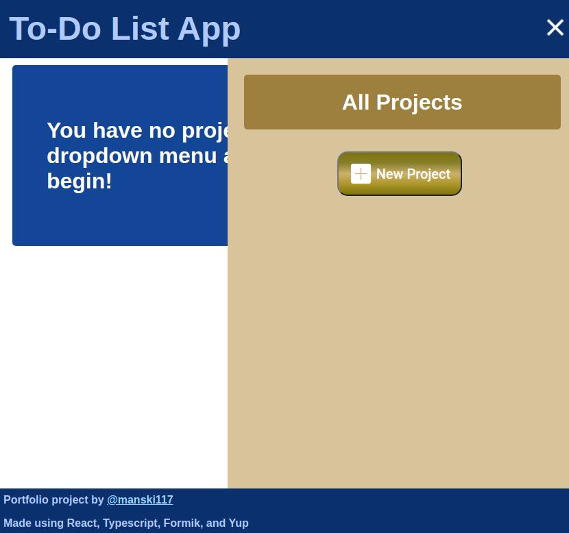

# Todo List React App
## Portfolio Project by Manski117
### Todo list app that allows user to manage projects and tasks in user-friendly GUI and save projects to local storage.

### [Live Preview](https://todo-app-manski117.netlify.app/)

**Purpose of Project:**
This portfolio project is a todo list app that showcases my skills in front-end web development, validation and sanitization of user-inupt data, and user-friendly, accessible design.

**Core Features:**
This project implements formik and yup libraries to validate and sanizize user data. Using react hooks such as useContext, input data being typed is compared in real-time to other projects saved in state to ensure no chance of naming collisions. Makes use of localStorage to save user data without the need for a back-end or logging in. Users may safely edit or delete any of their projects and tasks.

**User Experience:**

Page load with no existing data

Page load with existing data prompts user to open projects sidebar

Small screen users experience project sidebar as menu overlay

